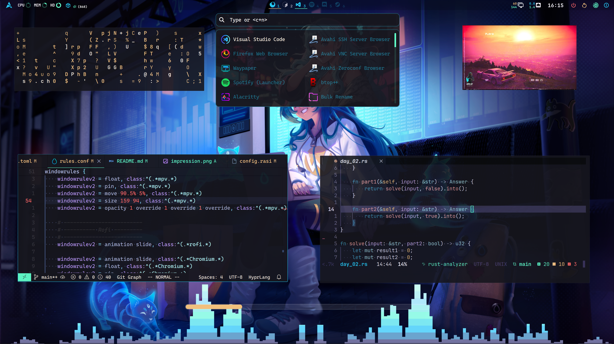
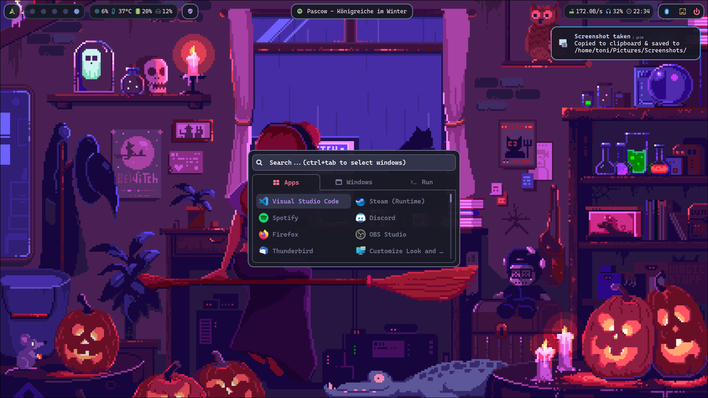

<div align="right">🖕</div>

# Dotfiles 

<div align="center">
  
  
</div>

<div align="center">
  <a href="https://github.com/tonigineer/zsh"></a>
  <a href="https://github.com/tonigineer/nvim"></a>
</div>

<br>

<div align="center">
  <p><em>A somewhat minimalist, workflow-focused desktop configuration emphasizing speed, clarity, and visual consistency.</em></p>
</div>

<div align="center">
  
  
</div>

## Missing/ToDo

- [ ] Reintegrate mpvpaper (legacy script)
- [ ] Implement hot-reload of color themes for Thunar and LibreWolf

## Installation

For setup, use the provided Bash installers. Execute [./scripts/install.sh](./scripts/install.sh)

```bash
git clone https://github.com/tonigineer/dotfiles.git ~/Dotfiles
cd ~/Dotfiles

./scripts/install.sh
```


> [!NOTE]
> See the Arch Linux installation documentation in [./docs](./docs) or refer directly to the [ArchWiki](https://wiki.archlinux.org/title/Main_page).


## Features

- [x] Compositor: [Hyprland](https://github.com/hyprwm/Hyprland)
- [x] Shells: [Caelestia](https://github.com/caelestia-dots/shell) (aesthetics) and [Noctalia](https://github.com/noctalia-dev/noctalia-shell) (workflow)
- [x] Editors: [Zed](https://zed.dev/) and [Neovim](https://neovim.io/)
- [x] Terminal: [Kitty](https://sw.kovidgoyal.net/kitty/) with [ZSH](https://www.zsh.org/); tools include Yazi, fastfetch, cava, etc.
- [x] GPU: NVIDIA RTX 40-series; [Gamescope](https://github.com/ValveSoftware/gamescope) and [MangoHud](https://github.com/flightlessmango/MangoHud) supported
- [x] Dynamic color theming via both shells for multiple applications, including [Discord](https://github.com/Vencord/Vesktop)

> [!IMPORTANT] Important — Hyprland ecosystem
> [Hyprpaper](https://github.com/hyprwm/hyprpaper), [Hypridle](https://github.com/hyprwm/hypridle), and [Hyprlock](https://github.com/hyprwm/hyprlock/) are not used; equivalent functionality is provided by the shells.

## Keymaps


- <kbd>SUPER</kbd> + <kbd>RETURN</kbd> — Open Kitty terminal
- <kbd>SUPER</kbd> + <kbd>E</kbd> — Open Yazi file manager in terminal 
- <kbd>SUPER</kbd> + <kbd>SHIFT</kbd> + <kbd>E</kbd> — Open Thunar file manager 
- <kbd>SUPER</kbd> + <kbd>R</kbd> — Open launcher (application menu; varies by shell)
- <kbd>SUPER</kbd> + <kbd>S</kbd> — Open control center/sidebar (system controls; varies by shell)
- <kbd>SUPER</kbd> + <kbd>D</kbd> — Open control dashboard (Caelestia only)

- <kbd>SUPER</kbd> + <kbd>SHIFT</kbd> + <kbd>C</kbd> — Close active window
- <kbd>SUPER</kbd> + <kbd>SHIFT</kbd> + <kbd>Q</kbd> — Open powermenu (varies by shell))
- <kbd>CTRL</kbd> + <kbd>ALT</kbd> + <kbd> Y</kbd> — Cast currently playing media URL to MPV player
- <kbd>CTRL</kbd> + <kbd>ALT</kbd> + <kbd>L</kbd> — Lock screen (varies by shell)

## Legacy

I have experimented with custom shells using [eww](https://https://github.com/elkowar/eww), [AGS](https://github.com/Aylur/ags), [Fabric](https://github.com/Fabric-Development/fabric), and [Quickshell](https://quickshell.org/). The [Quickshell](https://quickshell.org/) configurations used here are stable and well maintained, making them a time-efficient choice. Past experiments are included below for reference.

<div align="center">
  
  
</div>
<div align="center">
  
  
</div>
<div align="center">
  
</div>

---

<div align="center">
  <p>Built on <strong>Arch Linux</strong> • Powered by <strong>Hyprland</strong> • Inspired by <strong>r/unixporn</strong></p>
</div>
