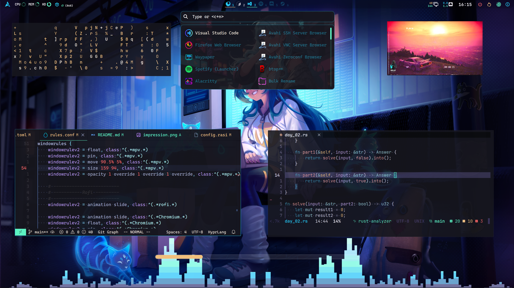

<div align="right">🖕</div>

<div align="center">


</div>

<br>

<div align="center">
<a href="https://github.com/tonigineer/zsh"><kbd>tonigineer/zsh</kbd></a> ❗ <a href="https://github.com/tonigineer/nvim"><kbd>tonigineer/nvim</kbd>
</a></div>

## 🎨 Impressions

I’m currently reworking my entire setup, switching from [AGS](https://github.com/Aylur/ags) to [Fabric](https://github.com/Fabric-Development/fabric).
github.com

<!-- <div align="center">
<kbd></kbd>
</div>

## 📖 Configuration details

The table below provides information on the key repositories, frameworks, and libraries used in my setup.

Category | Links and Information
---: | ---
Display Server| [Wayland](https://wiki.archlinux.org/title/Wayland)
Compositor | [Hyprland](https://hyprland.org/)
Graphics | [Nvidia](https://wiki.hyprland.org/Nvidia/)
🔧 | ➖ ➖ ➖
Wallpaper | [Hyprpaper](https://github.com/hyprwm/hyprpaper) & [mpvpaper]()
Bar & Side panel | [AGS](https://github.com/Aylur/ags)
Launcher | [AGS](https://github.com/Aylur/ags) (Modes: *bin*, *URL*, *duckduckgo*, *bash*)
Pi-Menu | [Kando](https://github.com/kando-menu/kando)
Lockscreen | [Hyprlock](https://github.com/hyprwm/hyprlock) & [Hypridle](https://github.com/hyprwm/hypridle)
🎨 | ➖ ➖ ➖
Color Scheme | [Tokyonight-Dark-BL-LB](https://github.com/Fausto-Korpsvart/Tokyo-Night-GTK-Theme)
Cursor | [Hyprcursor](https://github.com/hyprwm/hyprcursor) & [rose-pine-hyprcursor](https://github.com/ndom91/rose-pine-hyprcursor)
Icons | [Candy Icons](https://github.com/EliverLara/candy-icons)
💻 | ➖ ➖ ➖
Terminal Emulator | [Kitty](https://github.com/kovidgoyal/kitty)
Shell | [ZSH](https://www.zsh.org/) + <a href="https://github.com/tonigineer/zsh"><kbd>tonigineer/zsh</kbd></a>
Editor | [Nvim](https://github.com/neovim/neovim) + <a href="https://github.com/tonigineer/nvim"><kbd>tonigineer/nvim</kbd></a>
Files Explorer | [Yazi](https://github.com/sxyazi/yazi)
Visualizer | [Cava](https://github.com/karlstav/cava)
Resource Monitor | [BTop++](https://github.com/aristocratos/btop)

## 🥼 Installation

For my machine, simply cloning the repository and running the installation script should be enough to set up the environment:

```sh
git clone --recurse-submodules https://github.com/tonigineer/dotfiles.git ~/Dotfiles
cd ~/Dotfiles/scripts/install.sh all
```

> [!IMPORTANT]
> Some parts of this configuration, such as monitor names, are specific to my setup. As a result, it’s recommended to install the configuration manually, so you can tailor it to your system. Plus, you’ll likely pick up useful knowledge along the way.

> [!NOTE]
> Additionally, this configuration is designed for a 4K display. If you’re using a different resolution, certain aspects might behave differently or even break. For instance, tools like [hyprlock](https://github.com/hyprwm/hyprlock) rely on pixel-perfect positioning from anchors, so adjustments may be necessary.

## Keybindings

🔜 -->
