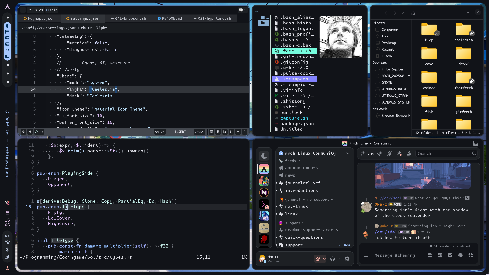
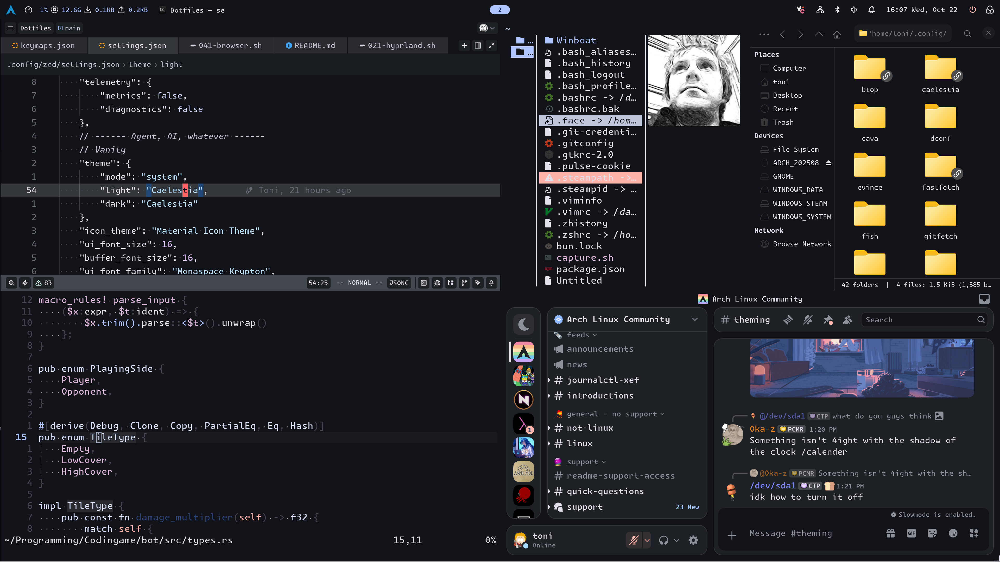
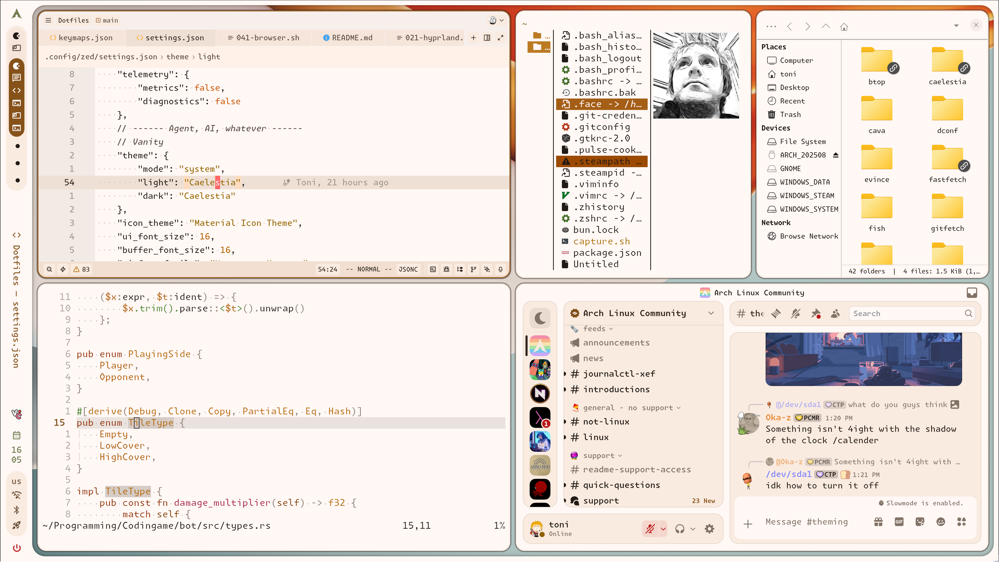
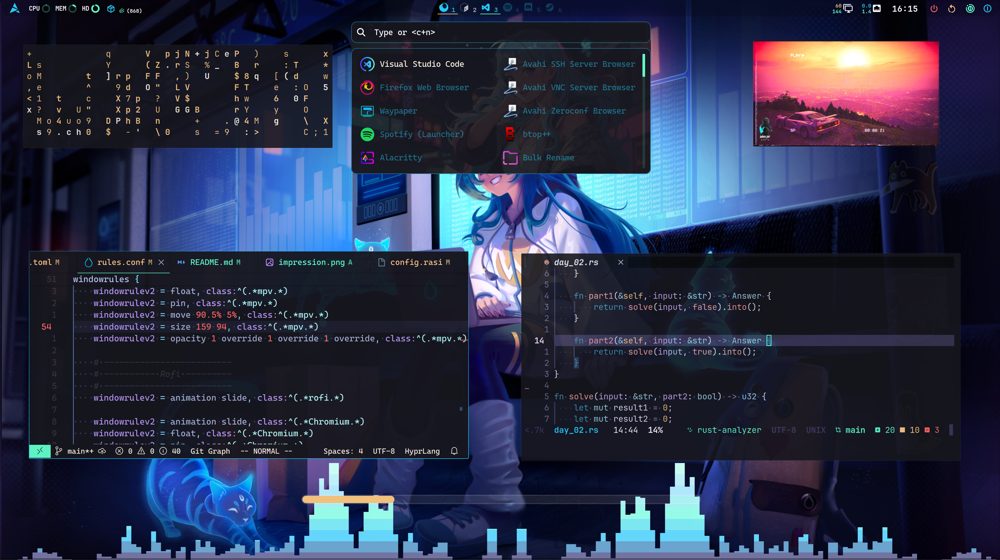
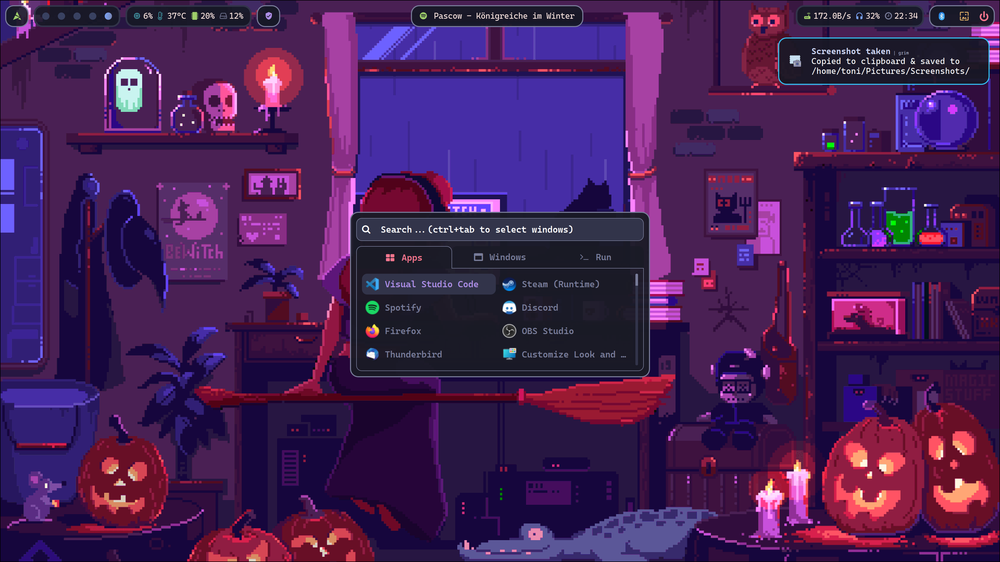

# Dotfiles

<div align="right">🖕</div>

<div align="center">
  
  
  <a href="https://github.com/tonigineer/dotfiles/actions/workflows/install-test.yml"></a>
</div>

<div align="center">
  <a href="https://github.com/tonigineer/zsh"></a>
  <a href="https://github.com/tonigineer/nvim"></a>
</div>

<br>

<div align="center">
  <p><em>“A minimalist, workflow-focused desktop configuration emphasizing speed, clarity, and visual consistency.”

— Slop</em></p>
</div>

## What's happening

I've fully transitioned to [Noctalia Shell v5](https://github.com/noctalia-dev) and [Zen Browser](https://zen-browser.app/).
<!--Below is a ~~walkthrough of my workflow~~ along with a demo of `wallcards`, a wallpaper selector, which I plan to convert into a [Noctalia Shell plugin](https://github.com/noctalia-dev/noctalia-plugins). This quickshell-based application is inspired by people on [unixporn](https://github.com/liixini/skwd).-->

https://github.com/user-attachments/assets/9ffbc83d-95e5-4dcd-a834-7bd224211b55

## Installation

For setup, use the provided Bash installers. Execute [./scripts/install.sh](./scripts/install.sh)

```bash
git clone https://github.com/tonigineer/dotfiles.git ~/Dotfiles
cd ~/Dotfiles

./scripts/install.sh
```

> [!NOTE]
> See the Arch Linux installation documentation in [./docs](./docs) or refer directly to the [ArchWiki](https://wiki.archlinux.org/title/Main_page).

## Features

- [x] Compositor: [Hyprland](https://github.com/hyprwm/Hyprland)
- [x] Shells: [Noctalia v5](https://github.com/noctalia-dev/noctalia-shell)
- [x] Editors: [Zed](https://zed.dev/) and [Neovim](https://neovim.io/)
- [x] Terminal: [Kitty](https://sw.kovidgoyal.net/kitty/) with [ZSH](https://www.zsh.org/); tools include Yazi, fastfetch, cava, etc.
- [x] GPU: NVIDIA RTX 40-series; [Gamescope](https://github.com/ValveSoftware/gamescope) and [MangoHud](https://github.com/flightlessmango/MangoHud) supported
- [x] Greeter & lockscreen: [SDDM](https://github.com/sddm/sddm) with [qylock](https://github.com/Darkkal44/qylock) 
- [x] Dynamic color theming for lots of applications

> [!IMPORTANT]
> Hyprland ecosystem — [Hyprpaper](https://github.com/hyprwm/hyprpaper), [Hypridle](https://github.com/hyprwm/hypridle), and [Hyprlock](https://github.com/hyprwm/hyprlock/) are not used; wallpaper/idle are handled by the shells, and the lockscreen is provided by [qylock](https://github.com/Darkkal44/qylock).

## Keymaps

- <kbd>SUPER</kbd> + <kbd>RETURN</kbd> — Open Kitty terminal
- <kbd>SUPER</kbd> + <kbd>E</kbd> — Open Thunar file manager
- <kbd>SUPER</kbd> + <kbd>SHIFT</kbd> + <kbd>E</kbd> — Open Yazi file manager in terminal
- <kbd>SUPER</kbd> + <kbd>R</kbd> — Open launcher
- <kbd>SUPER</kbd> + <kbd>S</kbd> — Open control center/sidebar

- <kbd>SUPER</kbd> + <kbd>SHIFT</kbd> + <kbd>C</kbd> — Close active window
- <kbd>SUPER</kbd> + <kbd>SHIFT</kbd> + <kbd>Q</kbd> — Open powermenu
- <kbd>CTRL</kbd> + <kbd>ALT</kbd> + <kbd>Y</kbd> — Cast currently playing media URL to MPV player
- <kbd>CTRL</kbd> + <kbd>ALT</kbd> + <kbd>N</kbd> — Start Netflix App (brave app functionality)
- <kbd>CTRL</kbd> + <kbd>ALT</kbd> + <kbd>U</kbd> — Start system update (`yay -Syu`)
- <kbd>CTRL</kbd> + <kbd>ALT</kbd> + <kbd>L</kbd> — Lock screen

### Custom utilities (Lua)

The Hyprland config is written in [native Lua](./.config/hypr/hyprland.lua); these are the bespoke helpers it adds (under [`conf/`](./.config/hypr/conf)), beyond plain app launches.

**Utility toggles** — <kbd>SUPER</kbd> + function keys ([`conf/keybinds.lua`](./.config/hypr/conf/keybinds.lua)):

- <kbd>SUPER</kbd> + <kbd>F1</kbd> — **Gamemode**: disable animations, blur, shadows, borders and gaps 
- <kbd>SUPER</kbd> + <kbd>F2</kbd> — **Hyprland log**: tail the Lua log (`hyprctl rollinglog | grep lua`)
- <kbd>SUPER</kbd> + <kbd>F3</kbd> — **DVD bounce**: floats every window on the workspace and bounces them off the edges and each other
- <kbd>SUPER</kbd> + <kbd>F4</kbd> — **Cursor toggle**: switch the cursor theme (Bibata ⇄ Nordzy, does not work properly)
- <kbd>SUPER</kbd> + <kbd>F5</kbd> — **Workspace names**: toggle Chinese-numeral workspace names
- <kbd>SUPER</kbd> + <kbd>F8</kbd> — **Secondary monitors**: disable / re-enable all non-active monitors

**Window management:**

- <kbd>SUPER</kbd> + <kbd>F</kbd> — **Smart float**: toggle floating, sized to 55% of the monitor and centered
- <kbd>SUPER</kbd> + <kbd>P</kbd> — **Smart pin**: picture-in-picture in the top-right (30% size); middle-mouse drag to move
- <kbd>SUPER</kbd> + <kbd>SHIFT</kbd> + <kbd>L</kbd> — Toggle the workspace tiling layout (master ⇄ scrolling)
- <kbd>SUPER</kbd> + <kbd>H</kbd>/<kbd>J</kbd>/<kbd>K</kbd>/<kbd>L</kbd> — Directional focus

**Multi-monitor:**

- <kbd>ALT</kbd> + <kbd>TAB</kbd> — Swap the workspaces shown on the two monitors
- <kbd>ALT</kbd> + <kbd>SHIFT</kbd> + <kbd>TAB</kbd> — Move the active workspace to the other monitor

**Special workspaces**

- <kbd>SUPER</kbd> + <kbd>grave</kbd> (<kbd>`</kbd>) — Toggle the **media** special workspace
- <kbd>SUPER</kbd> + <kbd>SHIFT</kbd> + <kbd>grave</kbd> — Move the active window to **media**
- <kbd>SUPER</kbd> + <kbd>SPACE</kbd> — Toggle the **scratchpad** special workspace
- <kbd>SUPER</kbd> + <kbd>SHIFT</kbd> + <kbd>SPACE</kbd> — Move the active window to **scratchpad**

**Media** (auto-pinned via [spawn_and_pin](./.config/hypr/conf/keybinds.lua)):

- <kbd>CTRL</kbd> + <kbd>ALT</kbd> + <kbd>Y</kbd> — Cast the currently playing Firefox media (URL + position) into a pinned **mpv**
- <kbd>CTRL</kbd> + <kbd>ALT</kbd> + <kbd>N</kbd> — Open **Netflix** as a pinned Brave app window
- <kbd>SUPER</kbd> + <kbd>F9</kbd>/<kbd>F10</kbd>/<kbd>F11</kbd> — Stream **Das Erste / ZDF / Phoenix** via mpv

**Screenshots & capture** ([`conf/capture.lua`](./.config/hypr/conf/capture.lua)):

- <kbd>Print</kbd> — Screenshot the active output
- <kbd>SHIFT</kbd> + <kbd>Print</kbd> — Screenshot a window
- <kbd>SUPER</kbd> + <kbd>SHIFT</kbd> + <kbd>S</kbd> — Screenshot a region (`hyprshot`)
- <kbd>CTRL</kbd> + <kbd>ALT</kbd> + <kbd>S</kbd> — Enter the **capture submap** (stops an active recording first): <kbd>m</kbd> screenshot monitor · <kbd>s</kbd> screenshot selection · <kbd>r</kbd> record monitor · <kbd>SHIFT</kbd>+<kbd>r</kbd> record selection · <kbd>esc</kbd> cancel

**Other tools:**

- <kbd>SUPER</kbd> + <kbd>SHIFT</kbd> + <kbd>Z</kbd> — Animated zoom toggle (`hypr-zoom`)
- <kbd>SUPER</kbd> + <kbd>mouse wheel</kbd> — Scroll-zoom the screen around the cursor
- <kbd>CTRL</kbd> + <kbd>ALT</kbd> + <kbd>M</kbd> — Toggle a `cmatrix` background panel

<!--Custom commands for the *Caelestia shell* launcher are:

- [x] `:Switch Shell` to change to *Noctalia Shell*
- [x] `:Live Wallpaper` to open a fuzzy list to select a live wallpaper (`mpvpaper`)
- [x] `:Live Stream ARD|ZDF|Phoenix` for german television streaming (`mpv`)-->


## Legacy

I have experimented with custom shells using [eww](https://https://github.com/elkowar/eww), [AGS](https://github.com/Aylur/ags), [Fabric](https://github.com/Fabric-Development/fabric), and [Quickshell](https://quickshell.org/). The [Quickshell](https://quickshell.org/) configurations used here are stable and well maintained, making them a time-efficient choice. Past experiments are included below for reference.
<div align="center">
  
  
</div>
<div align="center">
  
</div>

<div align="center">
  
  
</div>
<div align="center">
  
  
</div>
<div align="center">
  
</div>

---

<div align="center">
  <p>Built on <strong>Arch Linux</strong> • Powered by <strong>Hyprland</strong> • Inspired by <strong>r/unixporn</strong></p>
</div>
